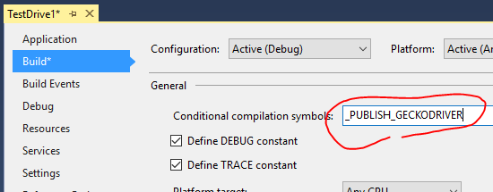

# NuGet package - Selenium WebDriver GeckoDriver

Win32, macOS, and Linux64 - [](https://www.nuget.org/packages/Selenium.WebDriver.GeckoDriver/) / Win64 - [](https://www.nuget.org/packages/Selenium.WebDriver.GeckoDriver.Win64/)

## What's this? / これは何?

This NuGet package install Gecko Driver for Selenium WebDriver into your Unit Test Project.

この NuGet パッケージは、Selenium WebDriver用 Gecko Driver を単体テストプロジェクトに追加します。

"geckodriver.exe" does not appear in Solution Explorer, but it is copied to bin folder from package folder when the build process.

"geckodriver.exe" はソリューションエクスプローラ上には現れませんが、ビルド時にパッケージフォルダから bin フォルダへコピーされます。

NuGet package restoring ready, and no need to commit "geckodriver.exe" binary into source code control repository.

NuGet パッケージの復元に対応済み、"geckodriver.exe" をソース管理リポジトリに登録する必要はありません。

## How to install? / インストール方法

For example, at the package manager console on Visual Studio, enter following command.  
一例として、Visual Studio 上のパッケージ管理コンソールにて、下記のコマンドを入力してください。

**Win32, macOS, and Linux64**

    PM> Install-Package Selenium.WebDriver.GeckoDriver

**Win64**

    PM> Install-Package Selenium.WebDriver.GeckoDriver.Win64

## Detail / 詳細

### Where is geckodriver.exe saved to? / どこに保存?

geckodriver(.exe) exists at  
" _{solution folder}_ /packages/Selenium.WebDriver.GeckoDriver. _{ver}_ /**driver**/ _{platform}_"  
folder.

     {Solution folder}/
      +-- packages/
      |   +-- Selenium.WebDriver.GeckoDriver.{version}/
      |       +-- driver/
      |       |   +-- win32
      |       |       +-- geckodriver.exe
      |       |   +-- mac64
      |       |       +-- geckodriver
      |       |   +-- linux64
      |       |       +-- geckodriver
      |       +-- build/
      +-- {project folder}/
          +-- bin/
              +-- Debug/
              |   +-- geckodriver(.exe) (copy from above by build process)
              +-- Release/
                  +-- geckodriver(.exe) (copy from above by build process)

 And package installer configure msbuild task such as .csproj to
 copy geckodriver(.exe) into output folder during build process.

### How to include the driver file into published files? / ドライバーを発行ファイルに含めるには?

"geckodriver(.exe)" isn't included in published files on default configuration. This behavior is by design.

"geckodriver(.exe)" は、既定の構成では、発行ファイルに含まれません。この挙動は仕様です。

If you want to include "geckodriver(.exe)" into published files, please define `_PUBLISH_GECKODRIVER` compilation symbol.

"geckodriver(.exe)" を発行ファイルに含めるには、コンパイル定数 `_PUBLISH_GECKODRIVER` を定義してください。



Anoter way, you can define `PublishGeckoDriver` property with value is "true" in MSBuild file (.csproj, .vbproj, etc...) to publish the driver file instead of define compilation symbol.

別の方法として、コンパイル定数を定義する代わりに、MSBuild ファイル (.csproj, .vbproj, etc...) 中で `PublishGeckoDriver` プロパティを値 true で定義することでドライバーを発行ファイルに含めることができます。 

```xml
  <Project ...>
    ...
    <PropertyGroup>
      ...
      <PublishGeckoDriver>true</PublishGeckoDriver>
      ...
    </PropertyGroup>
...
</Project>
```

#### Note / 補足 

`PublishGeckoDriver` MSBuild property always override the condition of define `_PUBLISH_GECKODRIVER` compilation symbol or not. If you define `PublishGeckoDriver` MSBuild property with false, then the driver file isn't included in publish files whenever define `_PUBLISH_GECKODRIVER` compilation symbol or not.

`PublishGeckoDriver` MSBuild プロパティは常に `_PUBLISH_GECKODRIVER` コンパイル定数を定義しているか否かの条件を上書きします。もし `PublishGeckoDriver` MSBuild プロパティを false で定義したならば、`_PUBLISH_GECKODRIVER` コンパイル定数を定義しているか否かによらず、ドライバは発行ファイルに含められません。
